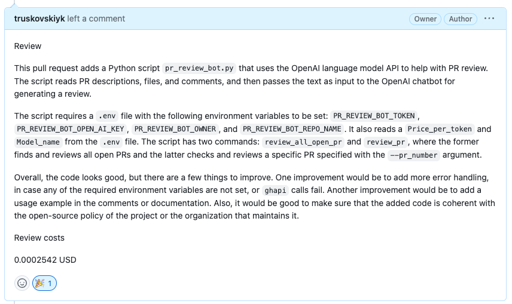

# pr-reviewer

Streamline Your GitHub Pull Requests with AI, co-authored with GPT4.

🚀 Excited to announce our new open-source project: PR Review Bot, a GitHub Pull Request review bot powered by OpenAI's GPT-3.5-turbo!
🤖 PR Review Bot automatically reviews open PRs in your GitHub repository, providing helpful feedback and even approving or requesting changes based on the analysis of the PR text and comments.
🔧 Save time and effort in your development workflow by automating the initial review process, ensuring PRs adhere to your project's guidelines and best practices.

🌟 Key features:
- Automatically reviews open PRs
- Leverages OpenAI's GPT-3.5-turbo for intelligent analysis and feedback
- Can be easily customized to fit your project needs
- Easy to set up and use
- Costs analysis of each review

## Example 



## Install

```
pip install pr-review-bot
```


## Setup

```
export PR_REVIEW_BOT_TOKEN='your github token'
export PR_REVIEW_BOT_OPEN_AI_KEY='your open ai key'
export PR_REVIEW_BOT_OWNER='github user'
export PR_REVIEW_BOT_REPO_NAME='github repo'
```

How to get [Github token](https://docs.github.com/en/enterprise-server@3.4/authentication/keeping-your-account-and-data-secure/creating-a-personal-access-token)
How to get [Open AI key](https://platform.openai.com/account/api-keys)


## Usage

To review all open pull requests:

```
pr-review-bot review-all-open-pr
```

To review a specific pull request:

```
pr-review-bot review-pr <PR nuber>
```

For help:


```
pr-review-bot --help
```

## Testing 


```
pytest --cov=pr_review_bot test_pr_review_bot.py
```
